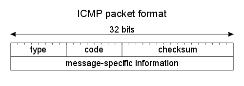

#
```
Network Types: LAN, WAN, PAN, CAN, MAN, SAN, WLAN
https://www.youtube.com/watch?v=4_zSIXb7tLQ
```
```
Network Topologies (Star, Bus, Ring, Mesh, Ad hoc, Infrastructure, & Wireless Mesh Topology)
https://www.youtube.com/watch?v=zbqrNg4C98U
```
```
What is a DMZ? (Demilitarized Zone)
https://www.youtube.com/watch?v=dqlzQXo1wqo
```
```
NAT Explained - Network Address Translation
https://www.youtube.com/watch?v=FTUV0t6JaDA
```
# 網路硬體
```
Layer-1:repeater(1-1), hub(1-N)
Layer-2:bridgr, switch
Layer-3: router,L3-Switch
Layer-4: L4 switch
Layer-7: L7 switch, proxy
```
# IEEE 802
```
● IEEE 802 指IEEE標準中關於區域網路和都會網路的一系列標準。更確切的說，IEEE 802標準僅限定在傳輸可變大小封包的網路。
  其中最廣泛使用的有乙太網路、權杖環、無線區域網路等。這一系列標準中的每一個子標準都由委員會中的一個專門工作群組負責。

● IEEE 802中定義的服務和協定限定在OSI模型的最低兩層（即實體層和資料鏈路層）。
  事實上，IEEE 802將OSI的資料鏈路層分為兩個子層，分別是邏輯鏈路控制（LLC, Logical Link Control）和媒介存取控制
 （MAC, Media Access Control），如下所示：
● 資料鏈路層
●   邏輯鏈路控制子層
●   媒介存取控制子層
● 實體層

現有標準
IEEE 802.1：高層區域網路協定（Bridging (networking) and Network Management）
IEEE 802.2：邏輯鏈路控制（Logical link control）

IEEE 802.3：乙太網路（Ethernet）
IEEE 802.4：權杖匯流排（Token bus）
IEEE 802.5：權杖環（Token-Ring）
IEEE 802.6：城域網（MAN, Metropolitan Area Network）
IEEE 802.7：寬頻TAG（Broadband LAN using Coaxial Cable）
IEEE 802.8：光纖分散式資料介面（FDDI）
IEEE 802.9：綜合業務區域網路（Integrated Services LAN）
IEEE 802.10：區域網路網路安全（Interoperable LAN Security）
IEEE 802.11：無線區域網路（Wireless LAN & Mesh）
IEEE 802.12：需求優先級（Demand priority）
IEEE 802.13：（未使用）
IEEE 802.14：電纜數據機（Cable modems）
IEEE 802.15：無線個人區域網路（Wireless PAN）
IEEE 802.15.1：無線個人區域網路絡（WPAN, Wireless Personal Area Network）
IEEE 802.15.4：低速無線個人區域網路絡（LR-WPAN, Low Rate Wireless Personal Area Network）
IEEE 802.16：寬頻無線接入（Broadband Wireless Access）
IEEE 802.17：彈性封包環傳輸技術（Resilient packet ring）
IEEE 802.18：無線電管制技術（Radio Regulatory TAG）
IEEE 802.19：共存標籤（Coexistence TAG）
IEEE 802.20：移動寬頻無線接入（Mobile Broadband Wireless Access）
IEEE 802.21：媒介獨立換手（Media Independent Handover）
IEEE 802.22：無線區域網（Wireless Regional Area Network）
IEEE 802.23：緊急服務工作群組（Emergency Services Working Group）
```
# 網路協定:
OSI
```
應用層 Application 

表達層 Presentation

會議層 Session 

傳輸層

OSI Model Explained | OSI Animation | Open System Interconnection Model | OSI 7 layers | TechTerms
https://www.youtube.com/watch?v=vv4y_uOneC0
```
### ARP
```
Address Resolution Protocol (ARP) - Explained with example | Computer network | TechTerms
https://www.youtube.com/watch?v=EC1slXCT3bg
MAC Address
```
### ICMP
```
Internet Control Message Protocol
```
#### ICMP Message Format封包格式:


```
ICMP 封包格式，其各欄位功能如下：
● 訊息型態（Message Type）：表示該 ICMP 所欲控制之訊息型態，共有 13 種型態，訊息型態之型態代表值如表 5-2 所示。
● 編碼（Code）：對各種訊息型態進一步說明工作內容。
● 檢查集檢查碼（Checksum）：對該封包檢查集錯誤偵測。
● 訊息說明（Message description）：依照不同的控制訊息，而有不同的說明方式。
```
### Message Type
```
ICMP 訊息功能

[重要]0  Echo Reply（回應答覆）
[重要]3  Destination Unreachable（目的地無法到達）

4 Source Quench（來源抑制）

[重要]5 Redirect（改變傳輸路徑）

[重要]8 Echo Request（回應要求）

9 Router Advertisement（路由器宣傳）
10 Router Solicitation（路由器懇請）
11 Time Exceeded for a Datagram（溢時傳輸）
12 Parameter Problem on a Datagram（參數問題）
13 Timestamp Request（時間標籤要求）
14 Timestamp Reply（時間標籤回覆）
15 Information Request（資訊要求）（停用）
16 Information Reply（資訊回覆）（停用）
17 Address Mask Request（位址遮罩要求）
18 Address Mask Reply（位址遮罩回覆）
```
### ICMP 常用指令
```
ping 
tracert| Traceroute
如何使用 TRACERT 疑難排解 Windows 中的 TCP/IP 問題
https://support.microsoft.com/zh-tw/help/314868/how-to-use-tracert-to-troubleshoot-tcp-ip-problems-in-windows
```
```
tracert www.pchome.com.tw

在上限 30 個躍點上
追蹤 www.pchome.com.tw [210.59.230.39] 的路由:

  1    <1 ms     2 ms     1 ms  172.20.155.254
  2    <1 ms    <1 ms    <1 ms  172.16.190.253
  3    <1 ms     1 ms     1 ms  120-114-151-14.ksu.edu.tw [120.114.151.14]
  4     *        *        *     要求等候逾時。
  5     *        *        *     要求等候逾時。
  6     *        *        *     要求等候逾時。
  7     *        *        *     要求等候逾時。
  8     *        *        *     要求等候逾時。
```
```
作業:tracert www.ksu.edu.tw
在上限 30 個躍點上
追蹤 www.ksu.edu.tw [120.114.100.65] 的路由:

  1     4 ms     7 ms     7 ms  172.20.155.254
  2    <1 ms    <1 ms    <1 ms  120-114-50-230.ksu.edu.tw [120.114.50.230]
  3    <1 ms    <1 ms    <1 ms  eng.www.ksu.edu.tw [120.114.100.65]

追蹤完成。

```

# Transport層協定:TCP(可靠的reliable) vs UDP (不可靠的unreliable)
```
何謂(可靠的reliable) vs (不可靠的unreliable)?
都(不可靠的unreliable)了,為何要用??
如何達到(可靠的reliable)?<----封包格式的設計
```
```
TCP vs UDP Comparison
https://www.youtube.com/watch?v=uwoD5YsGACg
```
### TCP vs UDP 
```
TCP vs UDP Comparison
https://www.youtube.com/watch?v=uwoD5YsGACg
```
### SSL, TLS, HTTP, HTTPS 
```
SSL, TLS, HTTP, HTTPS Explained
https://www.youtube.com/watch?v=hExRDVZHhig
```

###  Proxy Server
```
What is a Proxy Server?
https://www.youtube.com/watch?v=5cPIukqXe5w
```
### FTP (File Transfer Protocol), SFTP, TFTP Explained.
```
FTP (File Transfer Protocol), SFTP, TFTP Explained.
https://www.youtube.com/watch?v=tOj8MSEIbfA
```

### RFID
```
無線射頻辨識（英語：Radio Frequency IDentification，縮寫：RFID）
是一種無線通訊技術，可以通過無線電訊號識別特定目標並讀寫相關數據，而無需識別系統與特定目標之間建立機械或者光學接觸。
```

### NFC
```
近距離無線通訊（英語：Near-field communication，NFC）
又簡稱近距離通訊或近場通訊，是一套通訊協定，讓兩個電子裝置，（其中一個通常是行動裝置，例如智慧型手機）在相距幾公分之內進行通訊。
```

### TCP （Transmission Control Protocol）

```
可靠性:能確保傳輸的封包正確，確認是否有收到，封包格是正確，回傳時也正確。

不可靠性：傳輸的資料不管有沒有錯誤，都不會重新確認，不會受到影響的都可以接受。
```

### DNS
```

```

### DNS
```

```
### ARP -A
```
介面: 192.168.56.1 --- 0x4
  網際網路網址          實體位址               類型
  192.168.56.255        ff-ff-ff-ff-ff-ff     靜態
  224.0.0.3             01-00-5e-00-00-03     靜態
  224.0.0.22            01-00-5e-00-00-16     靜態
  224.0.0.251           01-00-5e-00-00-fb     靜態
  224.0.0.252           01-00-5e-00-00-fc     靜態
  239.255.255.250       01-00-5e-7f-ff-fa     靜態

介面: 172.20.155.126 --- 0xd
  網際網路網址          實體位址               類型
  172.20.155.16         88-d7-f6-53-83-c0     動態
  172.20.155.17         88-d7-f6-53-84-b5     動態
  172.20.155.22         88-d7-f6-53-24-ac     動態
  172.20.155.38         88-d7-f6-53-24-9b     動態
  172.20.155.50         88-d7-f6-53-82-e5     動態
  172.20.155.51         88-d7-f6-53-85-b8     動態
  172.20.155.56         38-2c-4a-c6-c6-29     動態
  172.20.155.61         88-d7-f6-53-84-19     動態
  172.20.155.71         88-d7-f6-53-84-7d     動態
  172.20.155.88         88-d7-f6-53-85-75     動態
  172.20.155.97         88-d7-f6-53-83-4a     動態
  172.20.155.100        88-d7-f6-53-83-98     動態
  172.20.155.102        70-4d-7b-a3-4c-d4     動態
  172.20.155.145        88-d7-f6-53-24-2b     動態
  172.20.155.153        88-d7-f6-53-24-87     動態
  172.20.155.157        70-4d-7b-a3-4d-68     動態
  172.20.155.178        38-2c-4a-c6-c2-e6     動態
  172.20.155.181        88-d7-f6-53-25-25     動態
  172.20.155.184        d0-17-c2-af-5e-b4     動態
  172.20.155.201        88-d7-f6-53-85-d5     動態
  172.20.155.216        88-d7-f6-53-83-0d     動態
  172.20.155.230        88-d7-f6-53-85-c3     動態
  172.20.155.231        88-d7-f6-53-85-a5     動態
  172.20.155.232        88-d7-f6-53-24-7b     動態
  172.20.155.254        00-14-1b-72-a8-00     動態
  172.20.155.255        ff-ff-ff-ff-ff-ff     靜態
  224.0.0.3             01-00-5e-00-00-03     靜態
  224.0.0.22            01-00-5e-00-00-16     靜態
  224.0.0.251           01-00-5e-00-00-fb     靜態
  224.0.0.252           01-00-5e-00-00-fc     靜態
  239.255.64.75         01-00-5e-7f-40-4b     靜態
  239.255.255.250       01-00-5e-7f-ff-fa     靜態
  255.255.255.255       ff-ff-ff-ff-ff-ff     靜態

介面: 192.168.173.2 --- 0xe
  網際網路網址          實體位址               類型
  192.168.173.255       ff-ff-ff-ff-ff-ff     靜態
  224.0.0.3             01-00-5e-00-00-03     靜態
  224.0.0.22            01-00-5e-00-00-16     靜態
  224.0.0.251           01-00-5e-00-00-fb     靜態
  224.0.0.252           01-00-5e-00-00-fc     靜態
  239.255.255.250       01-00-5e-7f-ff-fa     靜態
```
